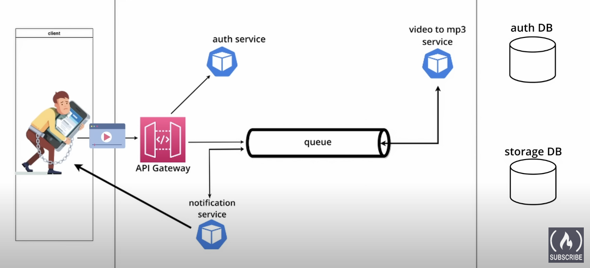

# k8s_system_design - Video to MP3 Converter Service

## Project Overview

This project leverages Kubernetes to orchestrate a microservice architecture designed to convert videos to MP3 format. Utilizing the scalability and management features of Kubernetes, this service aims to efficiently process video files and extract audio content.

## Architecture

System Diagram

In total there are 5 microservices and 2 databases

Microservices:

- Gateway: Clients interacts with this service which in turn relays request to all the other services
- Auth: Handles the authorization and authentication of any client trying to access the system.
- Converter: Converts videos to mp3s, ingesting new videos from the rabbitmq qs.
- Rabbit: Queues which allows for asynchronous interservice communication.
- Notification: Shoots a message to client's email with a mp3_id on completion of conversion to mp3.

Databases:

- MySQL: Contains auth db, which has users table containing username and password for authorization and authentication.
- MongoDb: Contains videos and mp3s db

## Getting Started

### Prerequisites

- Kubernetes
- Docker
- MySQL
- MongoDb
- Flask

### Deployment

Instructions on how to deploy the microservices on Kubernetes:
Ensure that you have the mysql db on your localsystem with the correct db and tables for authentication of users.
Ensure that mongodb is installed and running on the configured port on your local system. (27017)

1. Build Docker images for the microservices.
2. Configure Kubernetes resources (e.g., Deployments, Services, ConfigMaps, Secrets).
3. Apply the Kubernetes configurations to your cluster.
4. Verify the deployment.

Note: While applying kubernetes configuration, ensure that the rabbit service is setup before the others. Also ensure that minikube tunnel is on.

## Usage

How to use the service:
Once deployed, you can use curl for sanity check of the services using the endpoints accessible to the client.

Endpoints to interact with the service

- login -> Need to provide username: password for authorization. Returns the jwt
- upload -> Need to provide a video to be converted to mp3 and the jwt token for authentication.
- download -> Need to provide the mp3_id, jwt. Returns the converted mp3. Also need to specify the file path to download to for curl.

## Authors

- Jay Joshi

## Acknowledgement

This project was created as a part of learning how Kubernetes implements orchestration.
Reference to the base project: https://github.com/kantancoding/microservices-python.

Thank you @kantoncoding
